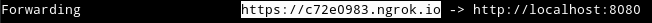

#  Emergency Queue

Node version (both client and server): 12.16.2.

## client

- Electron
- React
- TypeScript

To start the client in development mode, execute `npm start`.

## server

- Node
- Express
- TypeScript

The development docker-compose creates a development container for the server with an exposed shell. Start the services by executing `docker-compose -f docker-compose-dev.yml up -d`, then:

1. Open and attach to a new shell in the server container:

```bash
docker exec -it emergency-queue_server_1 /bin/bash
```
2. Start ngrok:

```bash
npm run ngrok
```

Copy your public ngrok URL and use it to forward Twilio webhooks:



3. Open and attach to a new shell in the server container (same as 1).

4. Use this shell to start your project or install new packages:

```bash
npm start
```

## Mongo DB

Mongo DB is started by the development docker-compose. Start the services by executing `docker-compose -f docker-compose-dev.yml up -d`.

You can check the logs by executing `docker logs -f emergency-queue_mongo_1`.

