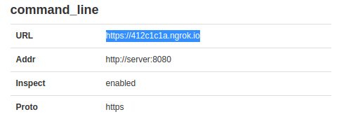

## Setup

> **Disclaimer:** <br>
> For now, the setup process to prepare and start all the components of the project is somewhat cumbersome, so please be patient. It will be open to improvements in the future.

##### Requirements

- Twilio account
- [Docker](https://docs.docker.com/get-docker/)
- [Docker Compose](https://docs.docker.com/compose/install/) (only for **Linux systems**, on desktop systems like Docker Desktop for Mac and Windows, Docker Compose is included as part of those desktop installs)

### 1. Prepare your Twilio account

In your Twilio account, you need to create and setup **two TwiML Apps**. For now, fill only the "Friendly Name", we will setup the Voice and Messaging webhooks in a later step.

For setup purposes, from now on we will refer to the TwiML Apps as _TwiML App 1_ and _TwiML App 2_.

> See [here](https://support.twilio.com/hc/en-us/articles/223180928-How-Do-I-Create-a-TwiML-App-) how you can create a TwiML App in the Twilio Console.

You also need to get **two Twilio phone numbers** with the following characteristics:

- _Phone number 1_ must have **SMS and Voice** capabilities. For both Voice and SMS, configure this phone number with _TwiML App 1_.

- _Phone number 2_ must have **Voice** capability. For Voice, configure this phone number with _TwiML App 2_.

> See [here](https://support.twilio.com/hc/en-us/articles/223135247-How-to-Search-for-and-Buy-a-Twilio-Phone-Number-from-Console) how you can get a Twilio phone number.

### 2. Environment variables

Open the [`server/.env`](server/.env) file and set the environment variables with the respective values from your Twilio account:

| Variable Name | Variable Value |
| --- | --- |
| TWILIO_ACCOUNT_SID | Your Twilio account identifier. Find it in the [Console](https://www.twilio.com/console). |
| TWILIO_AUTH_TOKEN | Your Twilio auth token. Find it in the [Console](https://www.twilio.com/console). |
| INCOMING_TWILIO_NUMBER | The **_Phone number 1_** in [E.164](https://en.wikipedia.org/wiki/E.164) format, e.g. "+351 987 654 321". |
| RESPONDERS_TWILIO_TWIML_APP_SID | The application identifier of the **_TwiML App 2_**. |
| RESPONDERS_TWILIO_NUMBER | The **_Phone number 2_** in [E.164](https://en.wikipedia.org/wiki/E.164) format, e.g. "+351 987 654 321". |


### 3. Start the services

In the root of the project, execute the following command to start ngrok, the server and the database:

```
docker-compose up -d --build
```

### 4. Finish configuring your TwiML Apps

Go to [localhost:4040/status](http://localhost:4040/status) and find the ngrok URL that allows public access to the locally-running server service:



Go back to the Apps your created in the first step and configure their webhooks with the ngrok URL in the following way:

- _TwiML App 1_:

    | Capability | URL | Method |
    | --- | --- | --- |
    | Voice | `${ngrokURL}`/api/voice/incoming | POST |
    | SMS | `${ngrokURL}`/api/text/holdtime | POST |

- _TwiML App 2_:

    | Capability | URL | Method |
    | --- | --- | --- |
    | Voice | `${ngrokURL}`/api/internal/call/dial  | POST |

### 5. Start the client

In the `client` folder, execute one of the following commands to build the executable file for the desired platform:

- **Windows**: 

```
docker-compose -f docker-compose-dist.yml run --rm client-build-windows
```

After the build is complete, execute the generated `dist/windows/client 0.1.0.exe` file.

- **Linux**: 

```
docker-compose -f docker-compose-dist.yml run --rm client-build-linux
```

After the build is complete, run the generated `dist/linux/client-0.1.0.AppImage` file.

- Alternativelly, you can start the client application in development mode by executing `npm run start`.

## License

[Apache License Version 2.0](http://www.apache.org/licenses/LICENSE-2.0)
